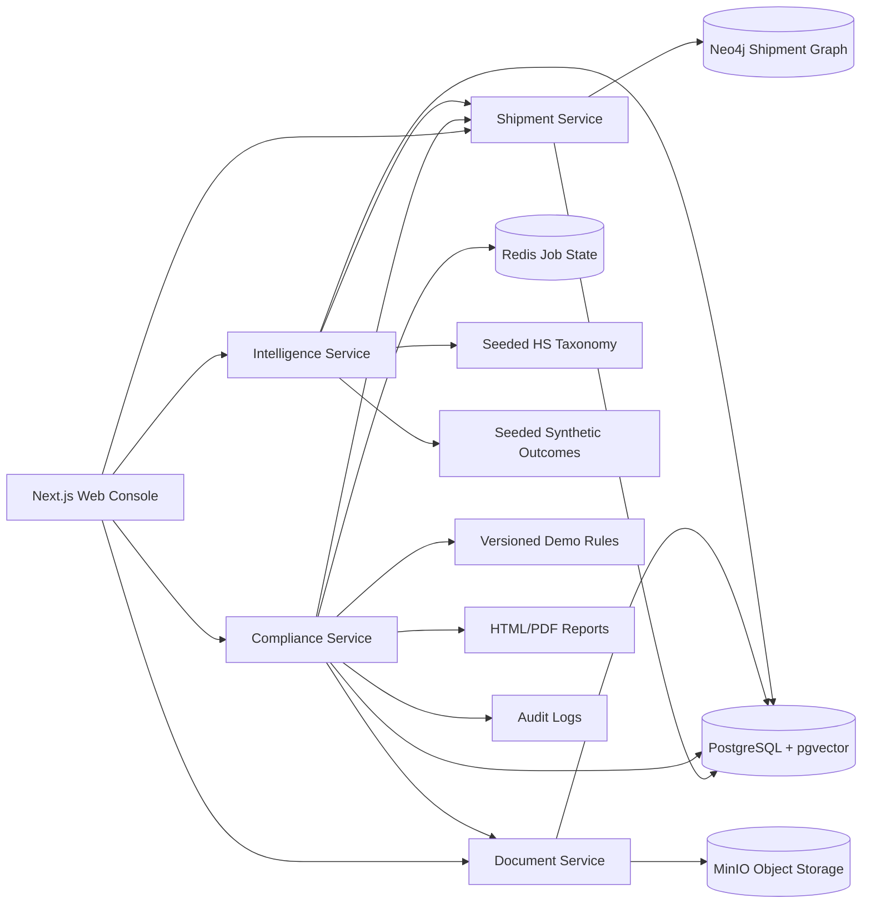

# Architecture Diagram

## Boundary Summary

- Shipment Service owns shipment lifecycle, events, route legs, and graph projection.
- Compliance Service owns deterministic rule evaluation, route optimization, reports,
  regulation impact analysis, RBAC, and audit logs.
- Document Service owns MinIO uploads, extraction metadata, and evidence records.
- Intelligence Service owns mock-first HS recommendations and synthetic risk scoring.
